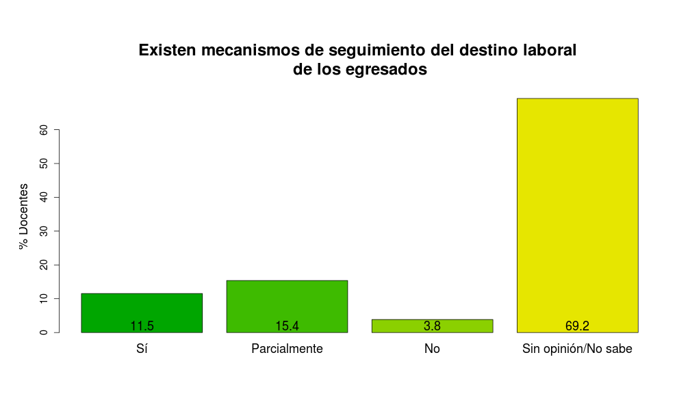

# Docentes - Bioquímica 2014
## Descripción
Aquí presentamos los resultados de las encuestas de `evaluación institucional` llevada a cabo en agosto del 2014 en la que se recabaron datos de los `docentes de la carrera de Bioquímica` de la Facultad de Química de la Universidad del Norte. La encuesta consistió en un formulario de `92 preguntas` evaluando cada una de las siguientes dimensiones:

* __Dimensión 1: Organización & Gestión__
    * 1.1: Organización
    * 1.2: Gestión
* __Dimensión 2: Proyecto Académico__
    * 2.1: Objetivos de carrerra y Perfil del Egresado
    * 2.2: Plan de estudios
    * 2.3: Proceso enseñanza-aprendizaje
    * 2.4: Evaluación del proceso enseñanza-aprendizaje
    * 2.5: Investigación y extensión
* __Dimensión 3: Personas__
    * 3.1: Directivos
    * 3.2: Docentes
    * 3.3: Estudiantes
    * 3.4: Personal administrativo y de apoyo
* __Dimensión 4: Recursos__
    * 4.1: Infraestructura, equipamientos e insumos
    * 4.2: Financiamiento
* __Dimensión 5: Resultados & Impacto__
    * 5.1: Egresados
    * 5.2: Impacto social

Se obtuvieron `26` formularios de respuestas, los cuales fueron cargados en una base de datos en formato `.csv` para su análisis estadístico. Los datos fueron procesados y analizados con [R](http://www.r-project.org) versión 3.1.1. Este documento fue redactado utilizando MarkDown en [RStudio](http://www.rstudio.com) versión 0.98.932 y el paquete [knitr](http://cran.r-project.org/web/packages/knitr/index.html) versión 1.6 de [Yihui Xie](http://yihui.name/knitr).


```r
# Establecemos las opciones globales
require(knitr)
opts_chunk$set(warning = FALSE, echo = FALSE, message = FALSE, fig.height = 8, fig.width = 14)
```


***

## Resultados

### Dimensión 1.1 - Organización
Los resultados de esta dimensión son los siguientes:
      

***
### Dimensión 1.2 - Gestión
Los resultados de esta dimensión son los siguientes:
             

***
### Dimensión 2.1 - Objetivos de la carrera y Perfil del Egresado
Los resultados de esta dimensión son los siguientes:
      

***
### Dimensión 2.2 - Plan de Estudios
Los resultados de esta dimensión son los siguientes:
        

***
### Dimensión 2.3 - Proceso enseñanza-aprendizaje
Los resultados de esta dimensión son los siguientes:
       

***
### Dimensión 2.4 - Evaluación del proceso enseñanza-aprendizaje
Los resultados de esta dimensión son los siguientes:
    

***
### Dimensión 2.5 - Investigación & extensión
Los resultados de esta dimensión son los siguientes:
        

***
### Dimensión 3.1 - Directivos
Los resultados de esta dimensión son los siguientes:
    

***
### Dimensión 3.2 - Docentes
Los resultados de esta dimensión son los siguientes:
      

***
### Dimensión 3.3 - Estudiantes
Los resultados de esta dimensión son los siguientes:
    

***
### Dimensión 3.4 - Personal administrativo y de apoyo
Los resultados de esta dimensión son los siguientes:
    

***
### Dimensión 4.1 - Infraestructura, equipamientos e insumos
Los resultados de esta dimensión son los siguientes:
          

***
### Dimensión 4.2 - Financiamiento
Los resultados de esta dimensión son los siguientes:
   

***
### Dimensión 5.1 - Egresados
Los resultados de esta dimensión son los siguientes:
    

***
### Dimensión 5.2 - Impacto social
Los resultados de esta dimensión son los siguientes:
    
